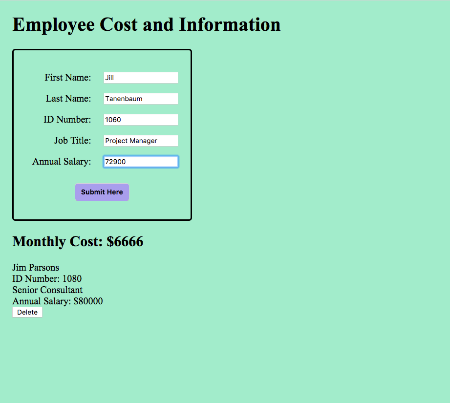
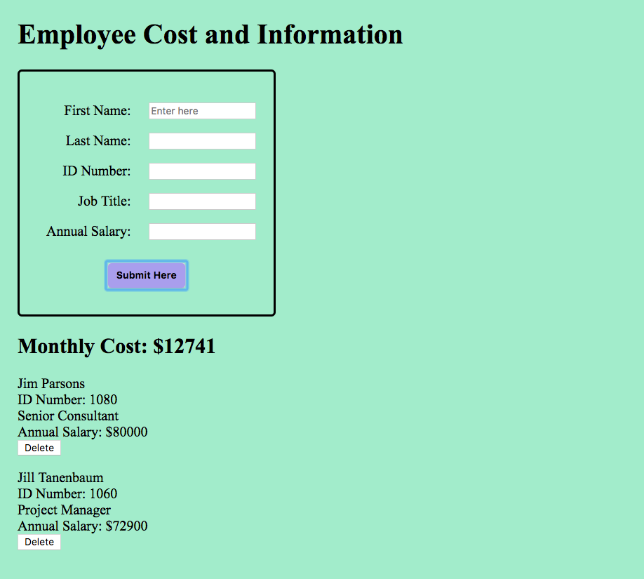

# Salary Calculator
In our first weekend assignment at Prime, we were tasked with building a jQuery calculator that determines the monthly cost of employees. The user can add an employee's personal info and annual salary, which is added to an array of employee data that totals the monthly cost for the company. Each employee can be deleted from the array. The user is prompted with a pop-up if not all fields are entered.

 

    
    

 

## Technology used
jQuery, HTML5, CSS. Focus on using object constructors.

## Current Limitations
* When an employee is deleted, monthly cost is not affected.
